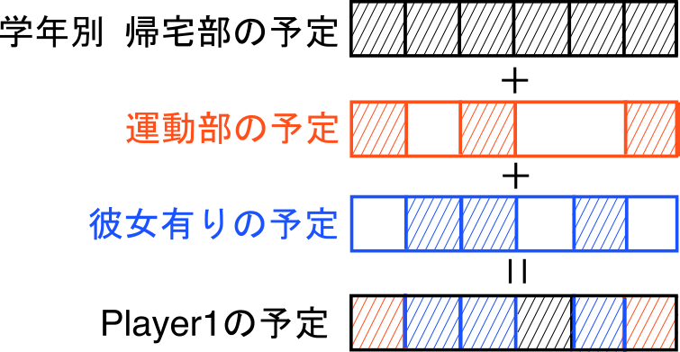

# ◯◯の夏休み

## メンバー(2班?)
プライバシーってことで書かない。

## ルール
- マス(日付)は44日ある
- 初期属性は、学年,部活,(彼女)
- サイコロを振って進む
- 止まったマス(日付)の予定でステータス変化、同じマスでポイント2倍
- 全員が一通り行動するとミニゲーム(参加する/しない)
- ゴールした人は自分のターンでサイコロを振って課題ポイントを減らす
- プレイヤーのステータスとしては、属性,充実ポイント,課題ポイント,金

| ステータス(属性) | 概要 |
|:-:|:-:|
|充P|多いと勝ち|
|課P|残っているとビリ|
|金| 勝敗に関係ないけ|
|彼女|確率的に存在|

## 物の抽出
- サイコロ
- コマ(プレイヤー)
	- 属性: 学年, 部活, 彼女(確率)
	- ステータス: 充実ポイント, 課題ポイント, 金
- マス(日付) - ステータスの変化がある
- 週一のイベント
- カレンダー

## 物の振る舞い
| 物 | 振る舞い |
|--:|:--|
|サイコロ|1~6を出す|
|コマ|サイコロを振る。進む。イベントをこなす|
|マス|予定によりステータス変化。コマの移動もある。(何マス休む)|
|週一のイベント|参加/非参加自由のミニゲーム|
|カレンダー|コマの位置を保持する|

## データ構造



カレンダー: コマの属性に合わせたマスの集合
#### カレンダーのデータ形式
- csvファイル
- 日付,内容,充実P,課題P,金額,N
- ↑を1行とする
- すなわち，基本カレンダー以外は40行あるとは限らない

コマ: 学年, 部活, 彼女(確率), 充P, 課P, 金

```コマ
typedef struct player_t{
	int grade;				// 学年
	int club;				// 部活(帰宅部/運動部/文化部)
	int girlfriend;			// 彼女(いる/いない)
	int enhance_p;			// 充実ポイント
	int task_p;				// 課題ポイント
	int money_p;			// 金
	int day;				// 現在何日目か
	TROUT_T calender[44];	// 自分のカレンダー
}PLAYER_T;
```

```マス
typedef struct trout_t{
	char content[200];	// 予定の内容(文章)
	int enhance_p;		// 充実ポイント(変化量)
	int task_p;			// 課題ポイント(変化量)
	int money_p;		// 金(変化量)
	int move_day;		// N日進む
}TROUT_T;
```

## 関数
[Function.md](./Function.md)
